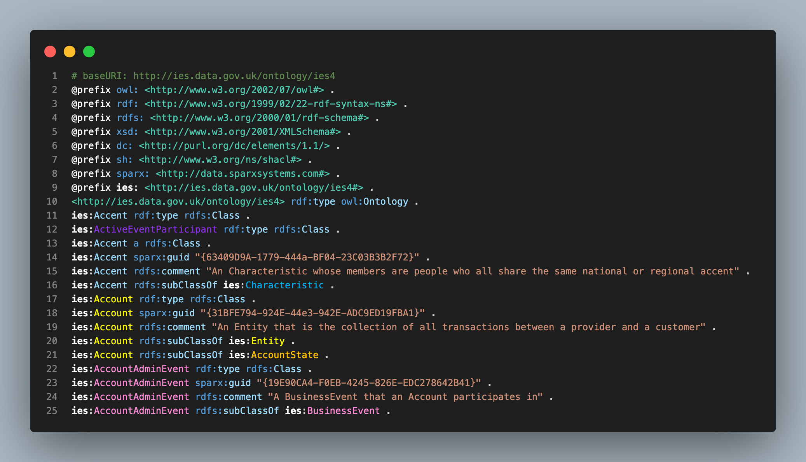
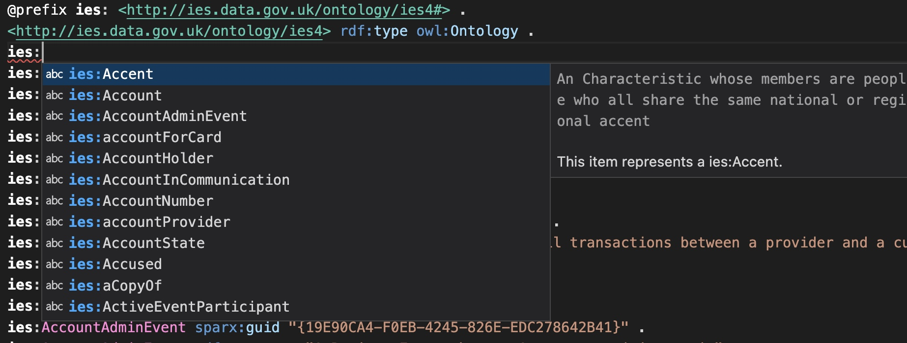

## IES Syntax Highlighter

The IES Syntax Highlighter is a Visual Studio Code (VS Code) extension designed to make working with IES in [Terse RDF Triple Language (TTL)](https://www.w3.org/TR/turtle/) (.ttl) files easier. This extension was created initially for internal use within the Data Science team at Telicent to make working with IES in TTL files nicer.

More information about IES can be found here: [IES4 GitHub repository](https://github.com/dstl/IES4)

### Features

- **Colour highlighting:** Highlights IES classes according to their defined colours
- **Diagnostics:** Syntax highlights missing commas, dots, semicolons
- **Autocomplete Classes:** Suggests IES classes as you type
- **On-hover reveal URI type** Hover-over a URI to reveal its type

#### Color highlighting

#### Diagnostics

#### IES class suggestions

#### On hover matches

## Install

1. Download the latest release from: [IES Syntax Highlighter releases](https://github.com/Telicent-io/ies-ext/releases)

2. Bring up the Extensions view by clicking on the Extensions icon in the **Activity Bar** on the side of VS Code or the **View: Extensions** command `Cmd/Ctrl + Shift + x`.

3. Click on the Extensions view command dropdown, the three dots (`...`), located at the top of the Extensions view and select **Install from VSIX...**

4. Navigate to the downloaded file and select it.

5. Select theme IES Highlighter dark+ default `Cmd/Ctrl + k` then `Cmd/Ctrl + t`. Or go to the Extensions view -> ies-extension -> Set Color Theme.

The extension should now be activated when you open .ttl files.

Additional, optional, steps **if you don't want to change themes** and still have color highlighting:

6. **Go to VS Code settings** - open the Settings editor by navigating to `Code > Settings > Settings` or using the shortcut `Cmd/Ctrl + ,`

7. **Search settings** - In the Settings Search bar, type `editor.tokenColorCustomizations` and select `Edit in settings.json`

8. **Append contents** - Use `Ctrl/Cmd + C` and then `Ctrl/Cmd + V` to copy and paste the contents of the file [for_settings.txt](https://github.com/Telicent-io/ies-ext/blob/main/for_settings.txt) to the JSON in settings.

Further information on managing extensions in VS Code can be found on the [Microsoft VS Code Extension Marketplace](https://code.visualstudio.com/docs/editor/extension-marketplace) page.

## Usage

1. **Install** extension, as [above](#Install)

2. **Select theme** within the IES Syntax Highlighter extension page in VS Code, as required

3. **Create** or **open** a file ending with extension .ttl

4. **Enter IES TTL data** and the features of the IES Syntax Highlighter will highlight classes, diagnose syntax errors, autocomplete classes and track what type instances are.
